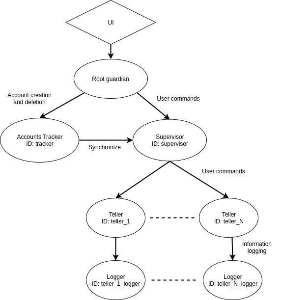

## Finance tracking app using purely Akka persistence 

### Background
I made this app due to ongoing frustrations of not being able to find an application that tracks my personal financial usage. 
This application allows you to create a new account. Each new account is able to record tansactions that you key in. If you 
want to remove the account, simply delete it.

### Description
A user account is managed by a single teller. Each teller is an Akka persistent actor. A teller has a **BankAccountState** that keeps track of the total present amount as well as a receipt archive (for you to review past transactions). These information are stored via event-sourcing using Akka's persistence framework. 

A teller has its own unique logger. A logger is a simple actor that has the capabilities to render information. Information can either be displayed 
on the screen or be logged into a log folder.

All tellers are managed under one common supervisor, which is also a persistent actor. The supervisor has a **BankAccountsRecord** state which keeps track of a list of bank account IDs that we have created. These bank account IDs will serve as the persistent-id for each actor, allowing Akka to restore
its state thoguht snapshot or event offerings. 

Finally, an AccountTracker, which is also a persistent actor, is created to register user account creation and deletion. The account tracker is very
similar to the supervisor. It is able to keep track of a list of accounts that the user creates or deletes. The only difference is in the granularity 
of the tracking. The AccountTracker registers each addition and deletion of accounts in the persistent database. It also serves as a source of truth for
the latest state of the account, in which we will use to synchronize with the supervisor. 

Synchronizing is the process of offering the supervisor a list of account IDs. The supervisor then compares the list with its latest state of IDs to see
which accounts need to be deleted and which new accounts need to be created. It performs the operations respectively and thereafter updates its latest
state. 

Any logging features from the app is handled by **Slf4jLogger** with logs being stored into the log directory in the project's root.  

### Architecture
The Finance tracker app was designed based on the following architecture: 


### Installation
To launch the UI, simply run 
```scala
sbt run
```
Its that simple :/